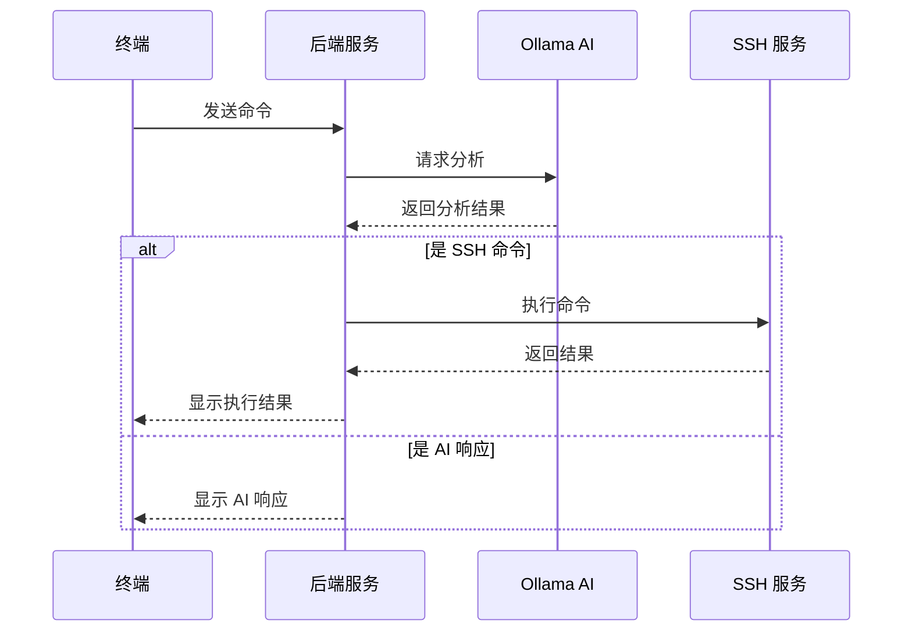

# AI 接口设计文档

## 1. 概述

本文档描述了 InfinityOps 终端与 Ollama AI 服务之间的接口设计。系统采用统一的命令处理流程，所有用户输入都经由 AI 进行分析和处理。

## 2. 接口流程



## 3. 接口定义

### 3.1 请求格式

```typescript
interface AIRequest {
  // 基础信息
  command: string;           // 用户输入的原始命令
  timestamp: string;         // ISO 格式时间戳
  requestId: string;         // 唯一请求ID

  // 会话上下文
  sessionContext: {
    currentDirectory: string;  // 当前工作目录
    lastCommands: Array<{     // 最近的命令历史
      command: string;
      timestamp: string;
      status: 'success' | 'error';
    }>;
    username: string;         // 当前用户名
    hostname: string;         // 主机名
  };

  // 系统上下文
  systemContext: {
    os: string;              // 操作系统类型
    distribution: string;     // 发行版信息
    kernelVersion: string;    // 内核版本
    locale: string;          // 系统语言设置
  };
}
```

### 3.2 响应格式

```typescript
interface AIResponse {
  // 基础信息
  requestId: string;         // 对应请求的ID
  timestamp: string;         // 响应时间戳
  type: 'SSH_COMMAND' | 'AI_RESPONSE';  // 响应类型

  // 内容部分
  content: {
    // SSH 命令相关字段
    command?: string;        // 主命令
    args?: string[];        // 命令参数
    workingDir?: string;    // 工作目录
    env?: Record<string, string>;  // 环境变量

    // AI 响应相关字段
    message?: string;       // 主要响应消息
    suggestions?: string[]; // 建议列表
    references?: string[];  // 参考资料链接
    explanation?: string;   // 详细解释
  };

  // 元数据
  metadata: {
    confidence: number;     // AI 确信度 (0-1)
    requireConfirm: boolean;// 是否需要用户确认
    risk: {
      level: 'safe' | 'moderate' | 'high' | 'critical';
      warning?: string;    // 风险警告信息
      impact?: string[];   // 可能的影响
    };
    executionEstimate?: {  // 执行预估
      time: number;        // 预估执行时间（毫秒）
      resources: string[]; // 涉及的资源
    };
  };

  // 错误信息（如果有）
  error?: {
    code: string;          // 错误代码
    message: string;       // 错误消息
    suggestion: string;    // 修复建议
    details?: any;         // 详细错误信息
  };
}
```

## 4. 示例

### 4.1 SSH 命令示例

```json
{
  "requestId": "cmd_1234567890",
  "timestamp": "2024-03-21T10:30:00Z",
  "type": "SSH_COMMAND",
  "content": {
    "command": "docker",
    "args": ["ps", "-a", "--format", "table {{.Names}}\t{{.Status}}"],
    "workingDir": "/home/user/projects"
  },
  "metadata": {
    "confidence": 0.95,
    "requireConfirm": false,
    "risk": {
      "level": "safe"
    },
    "executionEstimate": {
      "time": 500,
      "resources": ["docker.sock"]
    }
  }
}
```

### 4.2 AI 响应示例

```json
{
  "requestId": "cmd_1234567891",
  "timestamp": "2024-03-21T10:31:00Z",
  "type": "AI_RESPONSE",
  "content": {
    "message": "Docker 容器管理涉及以下几个核心概念：",
    "suggestions": [
      "使用 'docker ps' 查看运行中的容器",
      "使用 'docker images' 查看本地镜像",
      "使用 'docker logs <container>' 查看容器日志"
    ],
    "references": [
      "https://docs.docker.com/engine/reference/commandline/ps/",
      "https://docs.docker.com/engine/reference/commandline/images/"
    ],
    "explanation": "Docker 是一个开源的容器化平台，它可以让开发者轻松地打包、分发和运行应用程序..."
  },
  "metadata": {
    "confidence": 0.98,
    "requireConfirm": false,
    "risk": {
      "level": "safe"
    }
  }
}
```

## 5. 错误处理

### 5.1 错误类型定义

```typescript
enum ErrorCode {
  PARSE_ERROR = 'PARSE_ERROR',           // 命令解析错误
  EXECUTION_ERROR = 'EXECUTION_ERROR',   // 执行错误
  PERMISSION_ERROR = 'PERMISSION_ERROR', // 权限错误
  TIMEOUT_ERROR = 'TIMEOUT_ERROR',       // 超时错误
  NETWORK_ERROR = 'NETWORK_ERROR',       // 网络错误
  AI_SERVICE_ERROR = 'AI_SERVICE_ERROR', // AI 服务错误
  VALIDATION_ERROR = 'VALIDATION_ERROR', // 数据验证错误
  CONTEXT_ERROR = 'CONTEXT_ERROR'        // 上下文错误
}
```

### 5.2 错误响应示例

```json
{
  "requestId": "cmd_1234567892",
  "timestamp": "2024-03-21T10:32:00Z",
  "type": "AI_RESPONSE",
  "error": {
    "code": "EXECUTION_ERROR",
    "message": "Docker 守护进程未运行",
    "suggestion": "请检查 Docker 服务状态并启动：'sudo systemctl start docker'",
    "details": {
      "errorType": "ConnectionError",
      "dockerStatus": "inactive"
    }
  }
}
```

## 6. 安全考虑

### 6.1 命令验证
- 所有命令必须经过风险评估
- 高风险命令需要用户确认
- 系统命令必须在白名单内

### 6.2 上下文验证
- 验证工作目录权限
- 检查用户权限
- 验证环境变量安全性

### 6.3 资源限制
- 命令执行超时设置
- 资源使用限制
- 并发请求限制

## 7. 性能考虑

### 7.1 缓存策略
- 常用命令解析结果缓存
- AI 响应缓存
- 上下文信息缓存

### 7.2 优化措施
- 批量命令处理
- 异步响应处理
- 响应压缩

## 8. 下一步计划

1. 实现基础 AI 服务集成
2. 开发命令解析和处理逻辑
3. 实现错误处理机制
4. 添加安全验证层
5. 优化性能和响应时间
6. 实现监控和日志系统 